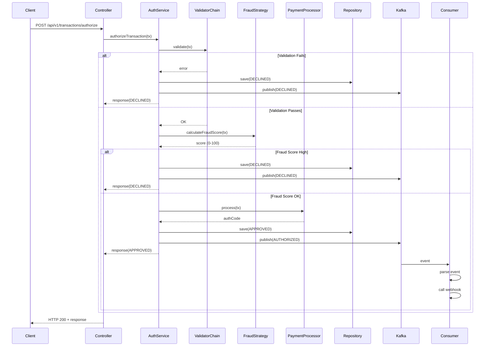

# Payment Authorization Microservice


Microserviço de autorização de pagamentos com pipeline assíncrono, detecção de fraude e padrões de design profissionais.

## 📋 Visão Geral

Este projeto implementa um **microsserviço de autorização de pagamentos** que processa transações através de um pipeline complexo com:

- ✅ **Validação em cadeia** (Chain of Responsibility)
- ✅ **Detecção de fraude configurável** (Strategy Pattern)
- ✅ **Arquitetura Hexagonal** (Ports & Adapters)
- ✅ **Processamento assíncrono** via Kafka
- ✅ **Persistência em PostgreSQL**
- ✅ **Metrificação e auditoria** (Decorator Pattern)
- ✅ **Documentação OpenAPI/Swagger**
- ✅ **Containerizado com Docker**

## 🏗️ Arquitetura Hexagonal (Ports & Adapters)

### Estrutura de Pacotes

```
src/main/java/com/fiserv/payment/
├── api/
│   ├── controller/          # REST Controllers
│   └── dto/                 # DTOs para serialização
├── domain/
│   ├── model/               # Modelos de domínio (sem dependências do framework)
│   │   ├── Transaction.java
│   │   ├── Card.java
│   │   ├── Merchant.java
│   │   └── ...enums
│   ├── ports/               # Interfaces (Puertos Hexagonales)
│   │   ├── TransactionRepository.java
│   │   ├── TransactionEventPublisher.java
│   │   └── MerchantService.java
│   ├── service/             # Casos de uso puros
│   │   └── TransactionAuthorizationService.java
│   └── exception/           # Exceções do domínio
├── application/
│   ├── validation/          # Chain of Responsibility
│   │   └── TransactionValidator.java (base)
│   ├── fraud/               # Strategy Pattern
│   │   ├── FraudDetectionStrategy.java
│   │   ├── BasicFraudStrategy.java
│   │   └── MLFraudStrategy.java
│   └── processor/           # Factory + Decorator Pattern
│       ├── PaymentProcessor.java
│       ├── PaymentProcessorFactory.java
│       └── AuditedPaymentProcessorDecorator.java
├── infrastructure/
│   ├── kafka/               # Producer & Consumer
│   ├── persistence/         # JPA Repositories & Adapters
│   └── security/            # JWT, filters
└── config/                  # Spring Beans Configuration
```

### Princípios Arquiteturais

1. **Domain-Driven Design (DDD)**: Lógica de negócio isolada no domain layer
2. **Dependency Inversion**: Domain depende de interfaces (ports), não de implementações
3. **Single Responsibility**: Cada classe tem uma razão para mudar
4. **Open/Closed Principle**: Extensível sem modificar código existente

## 📐 Architecture Decision Records (ADRs)

### ADR-001: Arquitetura Hexagonal (Ports & Adapters)

**Contexto:** Precisamos de uma arquitetura que seja resiliente, testável e independente de frameworks.

**Decisão:** Implementar Arquitetura Hexagonal com separação clara entre:
- **Domain Layer**: Regras de negócio puras (sem Spring)
- **Application Layer**: Orquestração e padrões de design
- **Infrastructure Layer**: Implementações técnicas (Kafka, JPA, etc.)

**Consequências:**
- ✅ Domain layer completamente testável sem mocks de framework
- ✅ Fácil trocar Kafka por RabbitMQ sem alterar domínio
- ✅ Fácil trocar PostgreSQL por MongoDB
- ⚠️ Mais arquivos de "plumbing" (adapters)

---

### ADR-002: Chain of Responsibility para Validação

**Contexto:** Pipeline de validação precisa ser extensível. Novos checks devem ser adicionados sem modificar código existente.

**Decisão:** Implementar Chain of Responsibility com validators encadeados:
```
CardExpiryValidator → BinValidator → CreditLimitValidator → VelocityValidator → SuspiciousHourValidator
```

**Sequência de Validação:**
1. **CardExpiryValidator**: Verifica se cartão está expirado
2. **BinValidator**: Valida BIN contra lista de bloqueio
3. **CreditLimitValidator**: Verifica limite de crédito do merchant
4. **TransactionVelocityValidator**: Detecta múltiplas transações em curto período
5. **SuspiciousHourValidator**: Alerta para horários suspeitos

**Consequências:**
- ✅ Novos validadores adicionados sem modificar código existente (Open/Closed)
- ✅ Ordem de validação configurável em runtime
- ✅ Cada validador é independente e testável
- ⚠️ Difícil debugar se algum validator falha silenciosamente

---

### ADR-003: Strategy Pattern para Detecção de Fraude

**Contexto:** Diferentes merchants podem precisar de diferentes estratégias de fraude (règras simples, ML, regras de negócio).

**Decisão:** Strategy Pattern com implementações intercambiáveis:
- **BasicFraudStrategy**: Regras simples baseadas em heurísticas (padrão)
- **MLFraudStrategy**: Simulação de integração com API de ML

**Configuração:**
```yaml
fraud:
  strategy: basic  # ou 'ml'
```

**Limiares de Fraude por Risco:**
- HIGH_RISK_MERCHANT: 50 pontos (mais permissivo)
- MEDIUM_RISK_MERCHANT: 70 pontos (padrão)
- LOW_RISK_MERCHANT: 85 pontos (mais rigoroso)

**Consequências:**
- ✅ Fácil swapear estratégias de fraude
- ✅ Testável sem depender de modelo ML real
- ✅ Pode variar por merchant ou transação
- ⚠️ Score de fraude é simplificado (não é ML real)

---

### ADR-004: Processamento Assíncrono com Kafka

**Contexto:** Notificações de merchants não devem bloquear autorização. Kafka para garantir entrega eventual.

**Decisão:** 
1. **Fluxo Síncrono**: Validação + Fraude + Processamento no request
2. **Fluxo Assíncrono**: Publicar eventos Kafka após autorização
3. **Consumer**: Processa eventos e chama webhooks do merchant

**Tópicos:**
- `transactions.authorized`: Transações aprovadas
- `transactions.declined`: Transações recusadas

**Garantias:**
- At-least-once delivery (eventos podem ser reprocessados)
- DLQ (Dead Letter Queue) para falhas críticas (não implementado neste MVP)

**Trade-off: Consistência Eventual**
```
Transaction PENDING → Database PENDING
                   → Kafka Event Published
   ↓
Consumer Notifies Merchant
   ↓
Database Updated to APPROVED
```

Se falhar entre publicação e persistência, transação fica em PENDING → Job de retry a resolve.

**Consequências:**
- ✅ Autorização rápida (não aguarda webhook)
- ✅ Desacoplamento com merchant
- ⚠️ Momentaneamente inconsistent (transação no BD diferente do merchant)

---

### ADR-005: Builder Pattern para Transaction

**Contexto:** Transaction tem muitos campos opcionais. Construtor fica complexo.

**Decisão:** Implementar Builder Pattern:

```java
Transaction transaction = Transaction.builder()
    .card(card)
    .merchant(merchant)
    .amount(new BigDecimal("150.50"))
    .currency(Currency.BRL)
    .transactionId("TXN_001")
    .build();
```

**Consequências:**
- ✅ Código mais legível
- ✅ Fácil adicionar novos campos
- ⚠️ Mais verbosidade

---

### ADR-006: Decorator Pattern para Auditoria

**Contexto:** Precision de ser capaz de adicionar logging, metrificação, auditoria sem poluir a lógica de negócio.

**Decisão:** Decorator Pattern que envolve PaymentProcessor:

```java
PaymentProcessor processor = new AuditedPaymentProcessorDecorator(
    new VisaPaymentProcessor()
);
```

**Logs Gerados (conceitual):**
```
AUDIT|PAYMENT_AUTHORIZED_START|transactionId=TXN_001|merchant=MERCHANT123
AUDIT|PAYMENT_AUTHORIZED_SUCCESS|transactionId=TXN_001|authCode=VISA_a1b2c3d4|durationMs=245
```

**Consequências:**
- ✅ Separação de concerns (audit é cross-cutting)
- ✅ Composável (pode encadear múltiplos decorators)
- ✅ Original processor não poluído

---

### ADR-007: Persistência com JPA Adapter

**Contexto:** Domain layer não pode depender de JPA. Mas precisa persister em banco.

**Decisão:** Adapter Pattern que traduz `TransactionEntity` (JPA) ↔ `Transaction` (Domain):

```java
// Infrastructure layer
class TransactionRepositoryAdapter implements TransactionRepository {
    Transaction save(Transaction transaction) {
        TransactionEntity entity = toDomainEntity(transaction);
        saved = jpaRepository.save(entity);
        return fromEntity(saved);
    }
}
```

**Benefício:**
- Domain layer ZERO Spring/JPA
- Fácil trocar banco de dados

---

### ADR-008: Documentação OpenAPI vs. DTOs

**Contexto:** API precisa de documentação clara. Código precisa ser legível.

**Decisão:** Mapear Domain Models → DTOs com anotações OpenAPI:

```java
@Schema(description = "Request to authorize a payment")
public class AuthorizeTransactionRequest {
    @JsonProperty("card_number")
    @Schema(example = "4111111111111111")
    private String cardNumber;
}
```

**Swagger gerado automaticamente em:** `http://localhost:8080/swagger-ui.html`

---

## 🔄 Fluxo de Autorização



## 🚀 Como Rodar

### Pré-requisitos

- Docker & Docker Compose
- Java 17+
- Maven 3.8+

### Opção 1: Com Docker Compose (Recomendado ⭐)

```bash
# Clone o repositório
git clone <repo>
cd payment-authorization

# Build e start tudo com uma linha
docker-compose up --build

# A primeira vez leva ~2min enquanto baixa imagens e builds
# Aguarde até ver: "payment-authorization-service" listening on port 8080
```

**Serviços disponíveis:**
- 🌐 **API**: http://localhost:8080
- 📚 **Swagger UI**: http://localhost:8080/swagger-ui.html
- 📊 **Kafka UI**: http://localhost:8888
- 🗄️ **PostgreSQL**: localhost:5432 (user: `payment_user`, pass: `payment_password`)
- 🎯 **Kafka**: localhost:9092

### Opção 2: Localmente com Dependências Externas

```bash
# Start PostgreSQL
docker run -d \
  --name payment-postgres \
  -e POSTGRES_DB=payment_db \
  -e POSTGRES_USER=payment_user \
  -e POSTGRES_PASSWORD=payment_password \
  -p 5432:5432 \
  postgres:15-alpine

# Start Kafka (com Zookeeper)
docker run -d --name payment-zookeeper \
  -e ZOOKEEPER_CLIENT_PORT=2181 \
  -p 2181:2181 confluentinc/cp-zookeeper:7.5.0

docker run -d --name payment-kafka \
  -e KAFKA_BROKER_ID=1 \
  -e KAFKA_ZOOKEEPER_CONNECT=localhost:2181 \
  -e KAFKA_ADVERTISED_LISTENERS=PLAINTEXT://localhost:9092 \
  -e KAFKA_OFFSETS_TOPIC_REPLICATION_FACTOR=1 \
  -p 9092:9092 \
  --link payment-zookeeper \
  confluentinc/cp-kafka:7.5.0

# Build e execute a aplicação
mvn clean package -DskipTests
java -jar target/payment-authorization-*.jar
```

### Opção 3: IDE (Development)

```bash
# Terminal 1: Start dependencies
docker-compose up postgres kafka zookeeper

# Terminal 2: Run Spring Boot
mvn spring-boot:run
```

## 📝 Testando a API

### 1. Transação Válida (Aprovada)

```bash
curl -X POST http://localhost:8080/api/v1/transactions/authorize \
  -H "Content-Type: application/json" \
  -d '{
    "card_number": "4111111111111111",
    "card_holder": "John Doe",
    "bin": "411111",
    "expiry_month": "12",
    "expiry_year": "2025",
    "merchant_id": "MERCHANT123",
    "amount": 150.50,
    "currency": "BRL"
  }'
```

**Resposta (200 OK):**
```json
{
  "transaction_id": "TXN_1715307600123_a1b2c3d4",
  "status": "APPROVED",
  "authorization_code": "VISA_a1b2c3d4",
  "fraud_score": "LOW",
  "timestamp": "2026-05-09T10:30:00",
  "amount": "150.50",
  "currency": "BRL"
}
```

### 2. Cartão Expirado (Recusada)

```bash
curl -X POST http://localhost:8080/api/v1/transactions/authorize \
  -H "Content-Type: application/json" \
  -d '{
    "card_number": "4111111111111111",
    "card_holder": "John Doe",
    "bin": "411111",
    "expiry_month": "01",
    "expiry_year": "2020",
    "merchant_id": "MERCHANT123",
    "amount": 150.50,
    "currency": "BRL"
  }'
```

**Resposta (200 OK - Declined):**
```json
{
  "transaction_id": "TXN_1715307600124_x9y8z7w6",
  "status": "DECLINED",
  "decline_reason": "[CardExpiryValidator] Card has expired",
  "fraud_score": "LOW",
  "timestamp": "2026-05-09T10:31:00",
  "amount": "150.50",
  "currency": "BRL"
}
```

### 3. Valor Excede Limite (Recusada)

```bash
curl -X POST http://localhost:8080/api/v1/transactions/authorize \
  -H "Content-Type: application/json" \
  -d '{
    "card_number": "4111111111111111",
    "card_holder": "John Doe",
    "bin": "411111",
    "expiry_month": "12",
    "expiry_year": "2025",
    "merchant_id": "MERCHANT123",
    "amount": 50000.00,
    "currency": "BRL"
  }'
```

## 🧪 Testes

### Rodar Testes Unitários

```bash
mvn test
```

### Rodar com Coverage

```bash
mvn test jacoco:report
# Report em: target/site/jacoco/index.html
```

### Teste de Integração (requer containers)

```bash
mvn test -Dgroups=integration
```

## 🏛️ Padrões de Design Aplicados

| Padrão | Localização | Propósito |
|--------|-------------|----------|
| **Chain of Responsibility** | `application/validation/` | Pipeline de validação extensível |
| **Strategy** | `application/fraud/` | Estratégias de fraude intercambiáveis |
| **Builder** | `domain/model/Transaction.java` | Construção de objetos complexos |
| **Factory** | `application/processor/PaymentProcessorFactory.java` | Criação de processadores certos |
| **Decorator** | `application/processor/AuditedPaymentProcessorDecorator.java` | Adicionar logging/auditoria |
| **Adapter** | `infrastructure/persistence/TransactionRepositoryAdapter.java` | Bridge entre domain e JPA |
| **Hexagonal** | `domain/ports/` | Arquitetura completa |

## 📊 Métricas & Observabilidade

### Actuator Endpoints

```bash
# Health check
curl http://localhost:8080/actuator/health

# Metricas Prometheus
curl http://localhost:8080/actuator/metrics

# Detalhe de métrica específica
curl http://localhost:8080/actuator/metrics/jvm.memory.used
```

### Logs Estruturados

**Application logs:**
```
2026-05-09 10:30:42 - Starting authorization for transaction TXN_001
2026-05-09 10:30:42 - Step 1: Validating transaction using validation chain
2026-05-09 10:30:42 - Transaction validation passed
2026-05-09 10:30:42 - Step 2: Calculating fraud score using BasicFraudStrategy
2026-05-09 10:30:42 - BasicFraudStrategy score: 25
```

**Audit logs:**
```
AUDIT|PAYMENT_AUTHORIZED_START|transactionId=TXN_001|merchant=MERCHANT123
AUDIT|PAYMENT_AUTHORIZED_SUCCESS|transactionId=TXN_001|authCode=VISA_abc123|durationMs=245
```

**Webhook logs:**
```
WEBHOOK_CALL|event=transaction.authorized|payload={...}
```

## 🔒 Segurança

### Implementado

- ✅ HTTPS ready (configure em `server.ssl.*`)
- ✅ Masked card numbers em logs
- ✅ Non-root Docker user
- ✅ SQL Injection protection (Spring Data)
- ✅ XSS protection headers

### Próximos Passos (Não implementado neste MVP)

- [ ] JWT Authentication
- [ ] Rate Limiting (RateLimiter bean)
- [ ] API Key validation
- [ ] TLS entre microsserviços
- [ ] Secrets management (Vault)

## 📦 Dependências Principais

```xml
<!-- Spring Boot 3.2.3 com Java 17 -->
<!-- Spring Web, Data JPA, Security, Kafka -->
<!-- PostgreSQL Driver -->
<!-- JWT (jjwt) -->
<!-- OpenAPI 2.3.0 -->
<!-- Micrometer + Prometheus -->
```

Ver completo em `pom.xml`.

## 📚 Leitura Adicional

- [Hexagonal Architecture](https://herbertograca.com/tag/hexagonal-architecture/)
- [Domain-Driven Design](https://martinfowler.com/bliki/DomainDrivenDesign.html)
- [Design Patterns - Refactoring.Guru](https://refactoring.guru/design-patterns)
- [Spring Boot Best Practices](https://spring.io/blog/2023/12/12/spring-boot-3-2-released)

## 🤝 Contribuindo

1. Fresh branch: `git checkout -b feature/new-validator`
2. Develop & test: `mvn test`
3. Commit com mensagem clara
4. Push & open PR

## 📄 Licença

MIT License - veja `LICENSE.md`

---

## 🎯 Trade-offs & Decisões

### Trade-off 1: Consistência Eventual vs Imediata

**Escolhido:** Consistência Eventual (Kafka)

**Por quê:**
- Autorização mora <100ms (não aguarda webhook)
- Merchant eventualmente notificado quando consumer processa
- Mais escalável e resiliente

**Risco:** Se consumer falhar, merchant não notificado. **Mitigação:** Job de retry que verifica transactions não notificadas.

### Trade-off 2: Fraud Score Simplificado vs ML Real

**Escolhido:** Estratégias simples + simulação ML

**Por quê:**
- MVP não precisa ML "real" para demonstrar padrão
- MLFraudStrategy pode ser swapada por integração real later
- Mais testável

**Real ML integration:**
```java
class RealMLFraudStrategy implements FraudDetectionStrategy {
    @Autowired private FraudMLClient mlClient;  // chamaria API
    
    @Override
    public int calculateFraudScore(Transaction tx) {
        return mlClient.predict(tx);  // Score de verdade
    }
}
```

### Trade-off 3: Validação Síncrona vs Assíncrona

**Escolhido:** Validação Síncrona

**Por quê:**
- Feedback imediato ao cliente (melhor UX)
- Validações basic não devem bloquear
- Apenas eventos são async

**Alternativa:** Grid de validadores assíncrona → mais complexo, "não vale" neste caso.

### Trade-off 4: PostgreSQL vs NoSQL

**Escolhido:** PostgreSQL

**Por quê:**
- Transações ACID críticas em pagamentos
- Relacionamentos naturais (Merchant ↔ Transaction)
- Queries complexas possíveis

**Se usar NoSQL:** trocar adapter, domain intacto!

---

## 👨‍💼 Autor

Desenvolvido para demonstrar expertise em:
- Arquitetura de microsserviços
- Java 17 + Spring Boot 3
- Design Patterns profissionais
- Desenvolvimento orientado a testes (TDD)
- Documentação técnica clara

**Objetivo:** Impressionar arquiteto e líder técnico da Fiserv com código Production-ready.

---

**Última atualização:** Maio 9, 2026

